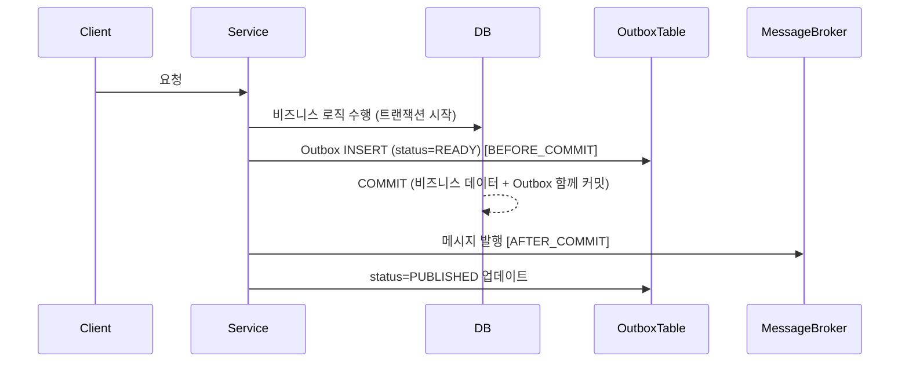

# Transactional Outbox, Inbox Pattern에 대하여

## OutBox Pattern이란?
분산 환경에서 메시지 브로커를 사용할때, 메시지 브로커와 트랜잭션의 일관성을 지키기 위한 패턴입니다.  
예를 들어 트랜잭션은 커밋이 되었지만, 메시지 브로커에 메시지를 발행 못했을 경우에는 데이터베이스에만 데이터가 저장이 되고, 그 뒤 작업이 처리가 안되는 현상이 발생할 수 있습니다. 
또 다른 경우에는 트랜잭션이 커밋이 되지 않고 롤백이 되었지만 메시지 밣행이 되었을경우에는  메시지 브로커는 어떤 데이터를 기반으로 메시지가 발행되었는지 인식을 하지 못하는 경우가 발생할 수 있습니다.
그래서 이런 문제를 해결하기 위해서 사용하는 패턴이 Outbox Pattern입니다.

## OutBox Pattern 동작 방식

Spring에서 `@Transactional`이 붙은 로직이 실행되면 트랜잭션이 시작됩니다. 
비즈니스 로직이 수행된 후, Spring에서 제공하는 `@TransactionalEventListener`를 이용하여 Outbox 테이블에 데이터를 삽입합니다. 
이때 `TransactionPhase.BEFORE_COMMIT`으로 설정하여 비즈니스 로직의 커밋 이전에 Outbox 데이터를 삽입합니다. 
이렇게 하면 비즈니스 로직과 Outbox 데이터가 하나의 트랜잭션으로 묶여 함께 커밋되어 정합성을 지킬 수 있습니다. 
그리고 `TransactionPhase.AFTER_COMMIT`으로 하나 더 선언하여 커밋이 완료된 후 메시지 브로커에 메시지를 발행합니다. 
이를 통해 트랜잭션과 메시지 브로커 간의 불일치 현상을 방지할 수 있습니다.

## OutBox Pattern 테이블 구성
Outbox Pattern에 필요한 테이블 컬럼은 아래와 같습니다.

<table>
  <thead>
    <tr>
      <th>컬럼명</th>
      <th>타입</th>
      <th>설명</th>
    </tr>
  </thead>
  <tbody>
    <tr>
      <td>id</td>
      <td>BIGINT / UUID</td>
      <td>기본키</td>
    </tr>
    <tr>
      <td>aggregate_type</td>
      <td>VARCHAR(255)</td>
      <td>이벤트가 발생한 도메인 객체의 유형 (e.g. Order)</td>
    </tr>
    <tr>
      <td>aggregate_id</td>
      <td>VARCHAR(25)</td>
      <td>이벤트가 발생한 특정 도메인 객체의 기본키 (e.g. Order의 기본키)</td>
    </tr>
    <tr>
      <td>event_type</td>
      <td>VARCHAR(255)</td>
      <td>발생한 이벤트의 유형 (e.g. OrderCreate)</td>
    </tr>
    <tr>
      <td>payload</td>
      <td>TEXT / JSON</td>
      <td>이벤트와 관련된 실제 데이터 (JSON 형식)</td>
    </tr>
    <tr>
      <td>timestamp</td>
      <td>TIMESTAMP</td>
      <td>이벤트가 Outbox 테이블에 기록된 시간</td>
    </tr>
    <tr>
      <td>status</td>
      <td>VARCHAR(30)</td>
      <td>메시지 처리 상태 (READY, PUBLISHED)</td>
    </tr>
  </tbody>
</table>

